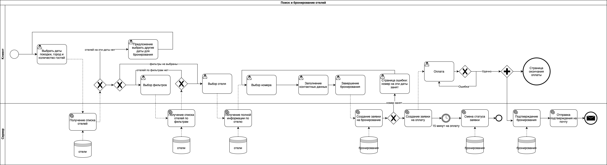

# БЛПС лабораторная работа 1

## Вариант: 1102

## Выполнили: Сиразетдинов Азат, Бушменев Константин

## Задание:

> Авиасейлс — поиск самых дешёвых билетов на самолёт — https://www.aviasales.ru/. Бизнес-процесс: поиск и бронирование
> отелей.

Описать бизнес-процесс в соответствии с нотацией BPMN 2.0, после чего реализовать его в виде приложения на базе Spring
Boot.

### Порядок выполнения работы:

1. Выбрать один из бизнес-процессов, реализуемых сайтом из варианта задания.
2. Утвердить выбранный бизнес-процесс у преподавателя.
3. Специфицировать модель реализуемого бизнес-процесса в соответствии с требованиями BPMN 2.0.
4. Разработать приложение на базе Spring Boot, реализующее описанный на предыдущем шаге бизнес-процесс. Приложение
   должно использовать СУБД PostgreSQL для хранения данных, для всех публичных интерфейсов должны быть разработаны REST
   API.
5. Разработать набор curl-скриптов, либо набор запросов для REST клиента Insomnia для тестирования публичных интерфейсов
   разработанного программного модуля. Запросы Insomnia оформить в виде файла экспорта.
6. Развернуть разработанное приложение на сервере helios.

# Swagger

Находится по ссылке http://localhost:8080/swagger-ui/index.html

# BPMN

# Лабораторная работа 2

## Вариант: 1118

## Задание:

Доработать приложение из лабораторной работы #1, реализовав в нём управление транзакциями и разграничение доступа к
операциям бизнес-логики в соответствии с заданной политикой доступа.

Управление транзакциями необходимо реализовать следующим образом:

1. Переработать согласованные с преподавателем прецеденты (или по согласованию с ним разработать новые), объединив
взаимозависимые операции в рамках транзакций.
2. Управление транзакциями необходимо реализовать с помощью Spring JTA.
3. В реализованных (или модифицированных) прецедентах необходимо использовать программное управление транзакциями.
4. В качестве менеджера транзакций необходимо использовать Atomikos.
5. Разграничение доступа к операциям необходимо реализовать следующим образом:

Разработать, специфицировать и согласовать с преподавателем набор привилегий, в соответствии с которыми будет
разграничиваться доступ к операциям.
1. Специфицировать и согласовать с преподавателем набор ролей, осуществляющих доступ к операциям бизнес-логики приложения.
2. Реализовать разработанную модель разграничений доступа к операциям бизнес-логики на базе Spring Security + JAAS.
3. Информацию об учётных записах пользователей необходимо сохранять в реляционую базу данных, для аутентификации
использовать HTTP basic. 

Правила выполнения работы:

1. Все изменения, внесённые в реализуемый бизнес-процесс, должны быть учтены в описывающей его модели, REST API и наборе
скриптов для тестирования публичных интерфейсов модуля.
2. Доработанное приложение необходимо развернуть на сервере helios.
